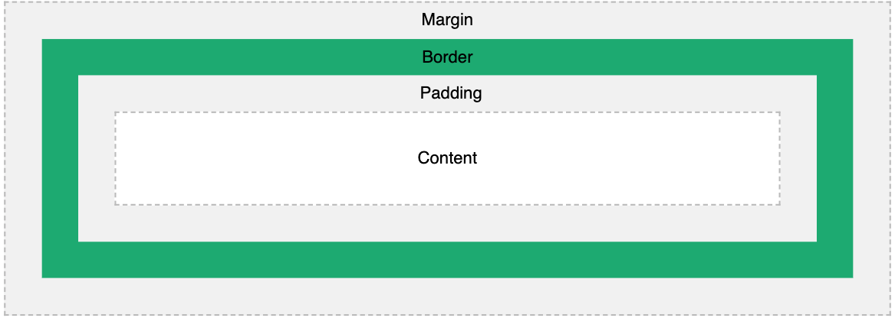

# The CSS Model Model
In CSS, the term **box model** is used when talking about design and layout.
The **CSS box model** is essentially a box that wraps around every HTML element. It consists of: *padding*, *borders*, *margins* and the actual content. The image below illustrates the box model:

## Explanation of the different parts:

- Content - The content of the box, where text and images appear
- Padding - Clears an area around the content. The padding is transparent
- Border - A border that goes around the padding and content
- Margin - Clears an area outside the border. The margin is transparent

# Exercise

In this exercise you will learn to use the CSS Box Model: padding, border, margin, width, height and box-sizing.

## Download/clone this [repo](https://github.com/muratkilic1978/css-box-model) to your machine

Next open the **style.css** from the repository that you downloaded above. Now open a new browser [Tab] on Chrome and watch the following video [Learn CSS Box Model in 8 Minutes](https://youtube.com/watch?v=rIO5326FgPE) an apply all what you see in this video to your **style.css** file.